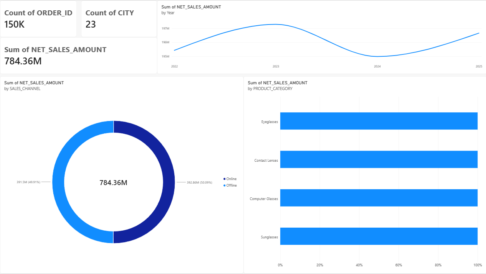
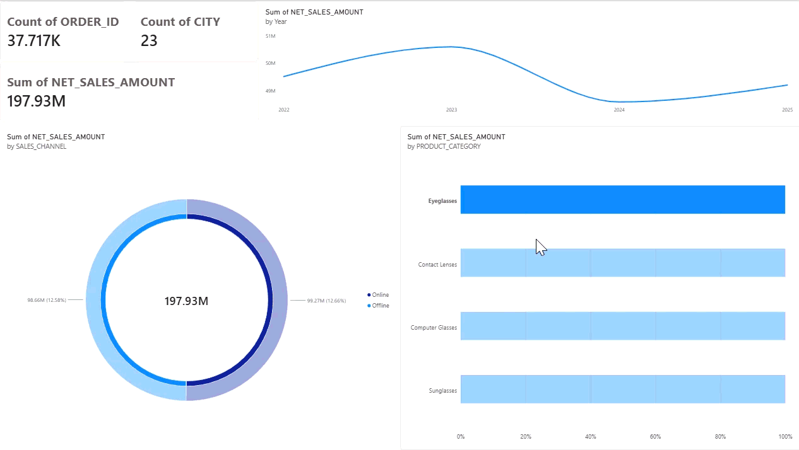

# Lenskart E-Commerce Telemetry & Real-Time Analytics Pipeline

## 🚀 Project Overview
An end-to-end data engineering and business intelligence project processing over **150,000 rows** of real-time e-commerce telemetry data. This portfolio project demonstrates full-stack data capabilities, covering cloud data warehousing via Snowflake, automated ingestion using Python, and executive-level visualization in Power BI.

🛠️ Architecture & Tech Stack
Ingestion & Processing: Python (`lenskart_snowflake_etl.py`)

Cloud Data Warehouse: Snowflake (`REALTIME_ECOMMERCE_DB`)

Visualization & BI: Power BI Desktop (`.pbix`) utilizing customized corporate UI/UX design standards.


📊 Key Dashboard Features
Executive KPI Cards: Immediate visibility into 150K Total Orders, 23 Active Cities, and $784.36M Total Net Sales.

Channel Distribution Donut Chart: Splits revenue seamlessly between online operations and offline retail channels.

Product Category Breakdown: Clean visual categorization for high-performing product groups.

Sales Trend Progression: Multi-year line chart mapping revenue velocity and growth history.

📸 Dashboard Preview


🎬 Interactive Workflow Demo


⚙️ How to Run This Project
Configure Snowflake Warehouse: Run the `realtime_telemetry_setup.sql` script to configure your target database, schemas, and tables.

Execute the ETL Pipeline: Run `lenskart_snowflake_etl.py` via Python to simulate or extract the telemetry dataset into your Snowflake warehouse.

Launch the Dashboard: Open `lenskart-telemetry-pipeline.pbix` in Power BI Desktop to explore the data model and interactive visuals.

---

## 📂 Repository File Structure
```text
├── lenskart-telemetry-pipeline.pbix             # Power BI executive dashboard file
├── lenskart_snowflake_etl.py                    # Python ETL & pipeline script
├── realtime_telemetry_setup.sql                 # Snowflake database and schema setup
├── lenskart-telemetry-dashboard-overview.png    # Dashboard architectural preview
└── lenskart-telemetry-pipeline-demo.gif         # Interactive workflow preview
